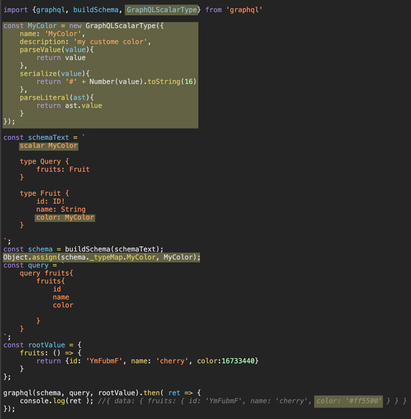

# GraphQL-自定义Scalar类型

我们知道*GraphQL*有五种默认的*Scalar*类型，**Int，Float，String，Boolean，ID**（类型解释参见[GraphQL-从入门到喜欢](./GraphQL-从入门到喜欢.md#schema)）。但是我们在实际运用中经常会有扩展*Scalar types*的需求，看个简单的例子：
```javascript
import {graphql, buildSchema} from 'graphql'

const schemaText = `
    type Query {
        fruits: Fruit 
    }

    type Fruit {
        id: ID!
        name: String
        color: String
    }

`;
const schema = buildSchema(schemaText);
const query = `
    query fruits{
        fruits{ 
            id
            name
            color
            
        }
    }
`;
const rootValue = {
    fruits: () => { 
        return {id: 'YmFubmF', name: 'cherry', color:16733440}
    }
};

graphql(schema, query, rootValue).then( ret => {
    console.log(ret );
});
```
如果我们想把其他服务返回的颜色值 *16733440* 统一处理成CSS中使用的16进制字符串`#xxxxx`，有没有办法在*Schema*中实现？答案是肯定的。由于`buildSchema(...)`这种形式没有办法注入相关的*parseXXX 和 serialize*方法，我们需要一些改动来实现这个功能。



可以看到改动后的结果`color:'#ff5500'`符合我们的要求，接下来分步看下我们到底做了哪些改动：

- 引入*GraphQLScalarType*这个用来实例化*Scalar*的类
- 创建*GraphQLScalarType*的实例*MyColor*，并声明一些属性和方法，我们先来看**serialize**这个方法，它接收到的是*resolver*返回的数据，方法内可以根据需求再次处理后返回给客户端。
- *Schema*中我们声明了自定义的*Scalar*类型，`scalar MyColor`，并在类型定义字段的时候使用它
- 通过`Object.assign(schema._typeMap.MyColor, MyColor)`，我们把自定义的*Scalar*类型注入到了通过`buildSchema(...)`构建好的*schema*中。**buildSchema会根据scalar声明自动生成GraphQLScalarType类型的对象，并且具有默认的方法和属性。必须通过显式的覆盖才能注入我们自定义的对象**。

经过以上的步骤，我们就能完成返回到客户端数据的处理。如果客户端请求时带过来的参数包含自定义*Scalar*类型又该怎么处理呢？这就要用到上文中我们暂时略过的`parseValue(value)`和`parseLiteral(ast)`两个方法，它们的调用时机和接收参数都是不同的：

方法名 | 参数类型 | 调用时机
----- | ------- | -------
parseLiteral | 经过GraphQL解析以后的AST节点 | 解析*query*中的行内scalar类型参数<br/>获取*resolver*方法的参数
parseValue | 普通字面量和传入时保持一致 | 解析*query*中通过变量传递的scalar参数

看下完整的例子：
```javascript
import {graphql, buildSchema, GraphQLScalarType} from 'graphql'

const MyColor = new GraphQLScalarType({
    name: 'MyColor',
    description: 'my custome color',
    parseValue(value){
        return value; 
    },
    serialize(value){
        return '#' + Number(value).toString(16)
    },
    parseLiteral(ast){
        return ast.value
    }
});
const schemaText = `
    scalar MyColor

    type Query {
        fruits(color: MyColor): Fruit 
    }

    type Fruit {
        id: ID!
        name: String
        color: MyColor
    }

`;
const schema = buildSchema(schemaText);
Object.assign(schema._typeMap.MyColor, MyColor);
const query = `
    query fruits($color:MyColor){
        fruits(color:$color){ 
            id
            name
            color
            
        }
    }
`;
const rootValue = {
    fruits: () => { 
        return {id: 'YmFubmF', name: 'cherry', color:16733440}
    }
};

graphql(schema, query, rootValue, null, {color: '#ccc000'}).then( ret => {
    console.log(ret ); //{ data: { fruits: { id: 'YmFubmF', name: 'cherry', color: '#ff5500' } } }
});
```

通过以上带变量的*query*查询时，会调用我们*MyColor*对象的*parseValue*方法，并得到'#ccc000'的参数。

改下查询的*query*，把参数改成行内传递。
```javascript
const query = `
    query fruits{
        fruits(color:"#fff000"){ 
            id
            name
            color
        }
    }
`;
```
再次运行会发现这次调用了*MyColor*对象的*parseLiteral*方法，参数为AST对象：
```javascript
ast = {
    block: false,
    kind: "StringValue",
    loc: {start: 40, end: 49, startToken: Tok, endToken: Tok, source: Source},
    value: "#fff000",
}
```
以上我们讲解了如何实现自定义*scalar*类型，相比*input*类型而言它要灵活的多，但是实践中需要我们自己完成*参数校验*和*格式化输出*等工作。
