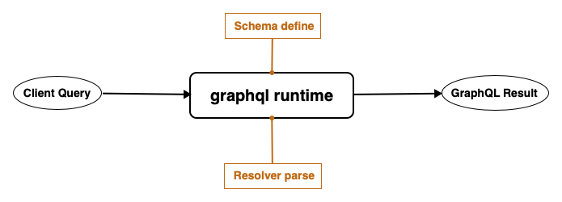
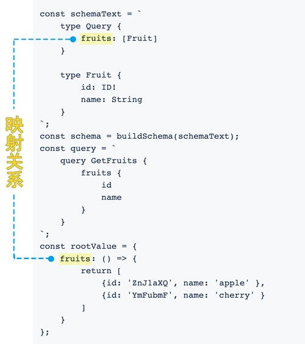
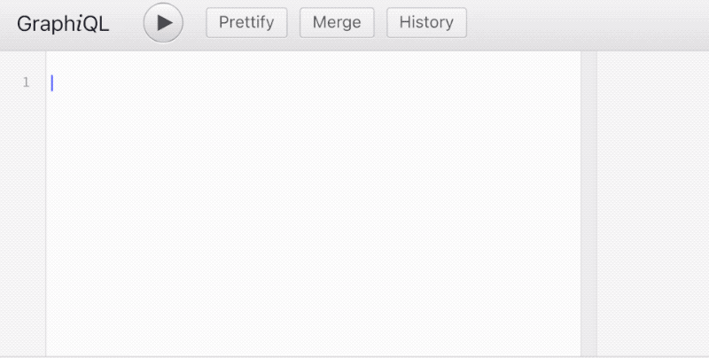
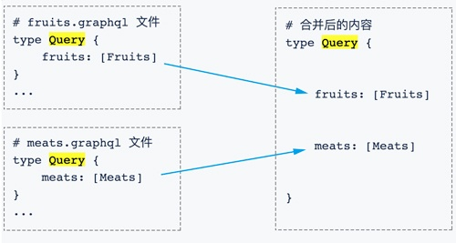

GraphQL是一种为API提供的查询语言，并且提供了实现这些数据查询的运行机制。最初由facebook于2013年创建，用于描述*Client-Server*服务模型的能力和需求。后来脱离编码语言层面提出了一个开放的标准，从2015年开始得到不断完善优化，2018年11月20日完成[*Working Draft*](https://graphql.github.io/graphql-spec/)。

官方提供了12种语言版本的GraphQL实现库，[GraphQL.js](https://graphql.github.io/graphql-js/)是在Javascript方向的实现，本文以此包为基础带大家领略**GraphQL**编码的风采。

## 基础知识
不管是将*GraphQL*应用在**B/S**模式还是**C/S**模式，都会涉及到系统数据的处理，我们先看一下 *GraphQL* 服务的数据处理流程：



接下来我们写个简单的例子来体验执行过程，然后了解一些基本概念：
```
import {graphql, buildSchema} from 'graphql'

const schemaText = `
    type Query {
        fruits: [Fruit]
    }

    type Fruit {
        id: ID!
        name: String
    }
`;
const schema = buildSchema(schemaText);
const query = `
    query fruits {
        fruits {
            id
            name
        }
    }
`;
const rootValue = {
    fruits: () => {
        return [
            {id: 'ZnJ1aXQ', name: 'apple' },
            {id: 'YmFubmF', name: 'cherry' }
        ]
    }
};

graphql(schema, query, rootValue).then( ret => {
    /* ret 返回值结构
    {
       "data": {
          "fruits": [
             {
                "id": "ZnJ1aXQ", 
                "name": "apple"
             }, 
             {
                "id": "YmFubmF", 
                "name": "cherry"
             }
          ]
       }
    }
    */
    console.log(ret )
})
```
从例子中我们可以看到有一个入口方法`graphql`，这个就是*GraphQL*提供的用于构建类型系统和服务的核心模块。
```javascript
graphql(
  schema: GraphQLSchema, //服务端提供的类型定义
  requestString: string, //客户端请求传入的 query
  rootValue?: ?any, //服务端提供的针对不同 query 的 resolver 集合
  contextValue?: ?any, //贯穿执行过程的一个可选的上下文环境变量
  variableValues?: ?{[key: string]: any}, //客户端请求传入可选的变量对象
  operationName?: ?string //多个 query 的时候需要指定一个
): Promise<GraphQLResult>
```
从例子和上述接口我们可以看出来，整个流程就是将服务端定义的 **schema** 和 **rootValue** 以及客户端请求的 **query** 交给*GraphQL*执行并取得结果。

基本流程搞清楚后咱们分别了解几个基本概念：

### schema

服务端定义的`schema`决定了对外提供的服务能力。它是一连串类型定义的集合，限定了客户端请求字段的选择范围以及返回值的数据结构。这是个很棒的特性，基本实现了代码即wiki，不用看wiki也能对数据结构一目了然。

GraphQL中用于定义`Schema`的是一种特殊的语法格式：*GraphQL schema language*。
```graphql
type Query {
    fruits: [Fruit]
}

"可选择添加类型描述文本"
type Fruit {
    id: ID!
    # 水果名称注释
    name: String 
}
```
以上是一个简单的*schema*文件，完成了两个类型定义：
- 定义`fruits`查询，返回值是*列表类型*，列表项为`Fruit`类型。
- 定义`Fruit`对象类型，包含字段`id`和`name`。

在实际项目中数据结构往往比这要复杂，但是不管多复杂的结构都要由一层层的对象类型来实现。


我们要做的大多数工作就是通过关键字`type`来定义我们自己的对象类型，对象类型的字段定义时需要指明类型（如`ID`），以及是否允许非空（`!`）。

可能你已经注意到了*schema*中的`Query`类型，没错它比较特殊！*GraphQL*提供两个保留字**Query**和**Mutation**用于定义*查询/更改*的入口。
```graphql
type Query{
    fruits: [Fruit]
    ...
}

type Mutation{
    mutateA: String
    mutateB: Boolean
    ...
}
```
`Query`中可以根据需求定义多个查询，**这些查询可以单个请求，也可以几个合在一起打包请求**。这种组织查询的形式正是*GraphQL*的特性所在，它使得API的组织对开发人员非常友好、灵活！

`Mutation`类型定义和`Query`类似，只是语义不同。

不管是*保留对象*还是*自定义对象*类型，定义它们的字段时都需要指定*字段类型*，比如上文看到的`String`，`Int`等，*GraphQL*内置了一些基本类型:
- 标量类型，包括`String`, `Int`, `Float`, `Boolean`, `ID`。
- 枚举类型，通过关键字`enum`定义。
- 列表类型，通过`[]`标识。
- 接口类型，通过关键字`interface`定义，其它类型可以通过`implements`声明实现接口。
- 联合类型，通过关键字`union`定义。
- 输入类型，通过关键字`input`定义。

内置类型对于我们限定返回值的数据类型非常有帮助，同时避免很多因为类型导致的问题。

### rootValue
从上文中我们了解到*schema*定义了查询的入口以及返回值，而这一过程的实现则是由*rootValue*对象负责。它包含的方法称为**resolver**，与*scheme*中定义的查询一一对应，每当接收到客户端的同名查询就会执行相应的方法。




*rootValue*中的*resolver*可以是异步方法，但是只有方法名和`type Query`中定义的查询名称匹配的时候，客户端查询才会返回结果。这也是`graphql(...)`方法返回异步结果的原因!

### query 
服务端的*schema*和*rootValue*都准备好后，我们的查询服务就是万事俱备，只欠东风啦！客户端通过向服务端发送格式化的*query*字符串,查询自己需要的对象和字段。比如：
```graphql
let queryString = `query fruits {
    fruits {
        id
        name
    }
}`
```
服务端接收到以上查询就会调用相应的*resolver*并返回该查询要求的`id`和`name`字段，查询字符串中行首的`query`称为操作类型，`fruits`称为操作名称。

### GraphQLResult
如前例的查询，正常应返回以下类似的结果
```javascript
{
   "data": {
       "fruits": [
          {
             "id": "ZnJ1aXQ", 
             "name": "apple"
          }, 
          {
             "id": "YmFubmF", 
             "name": "cherry"
          }
       ]
    }
}
```
**当有数据返回的时候，数据会放到*data*节点下，并按照客户端发送的查询名称组织内容**。下面我们改下查询字符串，发送一个未知的查询名试试看。
```graphql
//schema 中并没有定义名为 meats 的查询！
let queryString = `query meats {
    meats {
        id
        name
    }
}`
```
发送到服务端执行后返回结果如下：
```javascript
{
   "errors": [
      {
         "locations": [
            {
               "column": 5, 
               "line": 2
            }
         ], 
         "message": "Cannot query field \"meats\" on type \"Query\"."
      }
   ]
}
```
可以看到出现错误后返回的对象里包含了*errors*节点，并且里边的错误信息很友好！


**事实上无论是*GraphQL*内部的校验失败还是*resolver*中抛出的异常都会被捕获并放到`errors`节点数组中返回，如果异步*resolver*调用了`Promise.reject`，也会被当作错误处理。**

从以上结果我们可以看出`graphql`的返回是固定的数据结构：
```javascript
{
    errors: [GraphQLError], //没有错误时该节点为空 
    data: Object
}
```
## 开发工具
工欲善其事，必先利其器！*GraphQL*社区提供了一些工具库用于提升开发效率、降低系统复杂度。下边我们介绍两个常用的。

### GraphiQL
当查询内容比较复杂的时候，类型、字段太多容易混淆，我们可以使用 [GraphiQL](https://github.com/graphql/graphiql) 这个工具来简化*query*的拼写过程，它主要用来通过浏览器构建、调试查询条件和查看返回结果。



它还提供了根据*schema*生成*Docs*的功能，可以方便的浏览与查询对象类型。


### graphql-import
*schema*在定义的时候，考虑业务的复杂性对不同的业务进行模块化拆分是必要的，但是*GraphQL*本身不支持*schema*的模块化加载，我们可以采用第三方模块包[graphql-import](https://oss.prisma.io/content/graphql-import/overview)完成业务的拆分。

首先定义*schema*的入口文件*index.graphql*，然后通过如下导入两个模块。
```
# import FruitsType from 'fruits.graphql'
# import MeatsType from 'meats.graphql'
```
然后代码中调用*graphql-import*提供的方法就可以完成文件内容组合
```javascript
import {importSchema} from 'graphql-import'

const schemaString = importSchema('index.graphql')
```
模块的*schema*合并的时候，*graphql-import*会自动分析合并的内容，将不同模块定义的`type Query`类型合并成一个使其符合*GraphQL Schema*规范。



分模块定义类型的时候要注意命名问题，**相同的自定义对象类型会覆盖先前的定义**，可以采用的加模块前缀的方式避免重复定义。

## 总结
通过我们上面内容的介绍，相信你已经掌握了基本的入门知识，并且也了解了相关的开发工具，接下来就可以进入动手实践阶段。

实际使用的过程中还会遇到很多*GraphQL*的高级特性，比如查询条件的参数定义、客户端查询的变量使用等等，深入体会后你一定会越来越喜欢它！


