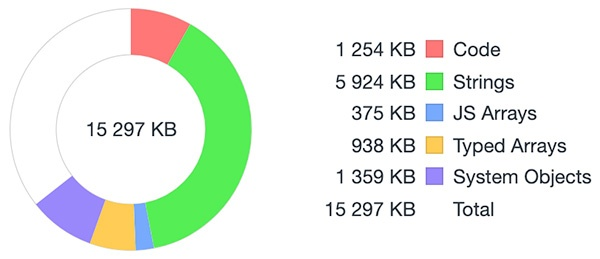

## 前言

无论是 Java 中的 *java.lang.OutOfMemoryError* ，还是 ASP.NET 中的 *System.OutOfMemoryException* ，偶尔一次内存泄漏对于传统的后端工程师来讲可谓是司空见惯的事情。

然而在Node编程中这个问题似乎并不常见或者说由于使用 Process Managers（进程管理器）做守护、重启，掩盖了这个问题的存在。之前一直是“**此漏只应Java有，Node哪的几回闻**”的心态，直到在一次测试环境中遇到它。

## 难以发现的OOM

```

// 让我们从一条日志说起...
2019-09-27T03:33:08.231Z qnc:pm2-messenger process exit with code: 1

```
“早上刚部署的服务，怎么中午访问就404了？“(一个莫名其妙令人悲伤的故事...)


完全的出乎意料，这是个用 `nohup npx `启动的node测试服务。难道是代码有BUG产生了“致命”异常导致进程退出了？于是开始了我的找寻真理（BUG）之旅！


首先想到的是**监听尽可能多的进程事件！**

```
// Node官方文档关于Exit Codes有一条如下：
// 1 Uncaught Fatal Exception - There was an uncaught exception, and it was not handled by a domain or an 'uncaughtException' event handler.

process.on('uncaughtException', (err, origin) => {
    console.error(err, origin)
})

// 俩小时之后，进程退出，日志并没有异常捕获相关的输出
```

进程退出总有个信号啥的吧，**肯定是我的监听还不够！**

```
function handle(signal) {
  console.log(`Received ${signal}`);
}

process.on('SIGINT', handle);
process.on('SIGHUP', handle);
process.on('SIGBREAK', handle);
process.on('SIGTERM', handle);

// 能用的都用上了，又是俩小时，日志无果
```

一时间毫无头绪，进程总不该是被*kill*掉的吧？
有人登机器杀进程？不该这么无聊啊！
不是人为难道是操作系统干的？


从系统日志(*/var/log/messages*)中有了重大发现：
```
Sep 27 11:33:05 domain-abc kernel: node invoked oom-killer: gfp_mask=0x200da, order=0, oom_score_adj=0
Sep 27 11:33:05 domain-abc kernel: node cpuset=/ mems_allowed=0
... (此处省略若干行内存日志)
...（还有进程列表日志）
Sep 27 11:33:06 domain-abc kernel: Out of memory: Kill process 12562 (node) score 786 or sacrifice child
Sep 27 11:33:06 domain-abc kernel: Killed process 12573 (node) total-vm:660944kB, anon-rss:76872kB, file-rss:0kB

```
至此，终于识得庐山真面目，**NodeJS遇上了OOM！**

从日志可以看出*node*触发了*oom-killer*，然后系统报告了当时的内存及进程详细情况，为了保护系统正常运转最终选择**kill node**（process 12562）。Linux的内存分配和管理比较有意思，感兴趣的同学可以扒一扒相关的关键词深入学习下(*overcommit-accounting*)。

大致上对于单个进程的内存管理来说，系统会按照特定算法不断给进程*打分*，并加入用户设定的 *oom_score_adj* 进行加权计算，最终得出 *oom_score* ，得分最高者会在系统发生*OOM*的时候被终止。其它系统如Android、IOS也有类似的机制。

## 问题定位与排查

结合上面的日志我们大致知道问题应该出在*node*对内存的使用上，接下来要进行的就是具体问题的定位。首先想到的就是分析**Heap Profiler**。

### 分析Heap Profiler

我们设定每分钟收集一次**Heap Profiler**数据，最终在被*kill*之前得到一些记录文件：

```
11M 18:35 18-35-profile.heapsnapshot
11M 18:36 18-36-profile.heapsnapshot
...
12M 19:01 19-1-profile.heapsnapshot
12M 19:02 19-2-profile.heapsnapshot
```


可以看出从18:35-19:02，我们的服务存活时长约半小时。通过*Chrome DevTools*对以上文件分析，我们选取服务开始（18:35）和结束前（19:02）两次采集的数据进行对比：


按照*Size Delta*排序后，可以看到变化最大的是 *Node/SimpleWriteWrap*

Constructor          | #New  | #Delete | #Delta | Alloc. Size | Freed Size | Size Delta
-------------------- | ----- | ------- | ------ | ----------- | ---------- | -----------
Node/SimpleWriteWrap | 2 673 |      86 | +2 587 |     791 208 |     25 456 | +765 752
... | | | | | |

但是就算这个对象数量增加导致*Size*有所增加，堆内存总量也只占服务器内存很小一部分！



看完这个统计我决定再试试其它办法，更直观的反馈*Node*进程的内存使用。

### 监控Node进程的内存使用

*Node*提供 `process.memoryUsage()` 这个可以实时查看进程的内存使用情况。和之前采集数据的方法一样，我们仍然设定每分钟收集一次数据，最终在被*kill*之前得到如下输出：

```
21:29 - {"rss":279068672,"heapTotal":64028672,"heapUsed":23900184,"external":4878125}
21:30 - {"rss":436371456,"heapTotal":64552960,"heapUsed":23961712,"external":4878125}
...
21:51 - {"rss":1082859520,"heapTotal":68345856,"heapUsed":34035624,"external":6653587}
21:52 - {"rss":1110204416,"heapTotal":61808640,"heapUsed":14772912,"external":718143}
```

对比服务开始（21:29）和结束前（21:52）的日志可以看到**rss**（Resident Set Size）从**270MB**飙到了**1.1GB**左右。


同时我也从系统层面对Node进程使用的资源进行了监控：


可以很直观的看出在两分钟内，CPU使用率一直较高，内存（MEM）使用更是从7%直线上升到54%，而且还呈现继续增加的态势！根据排查到的数据以及前文提及的Linux内存管理机制，问题已经非常明显——*Node*进程占用资源过多导致发生*OOM*时被系统终止。事实上无论是哪个进程触发*oom_killer*，系统都会选择终止消耗资源过多的进程。

## 如何解决

解铃还须系铃人，看来得仔细翻翻代码了！
```
...
forkedProcess.send(xxObject) // 好在demo代码并不多，最终定位到这一行。注释掉这行之后整个世界都安静了。
...
```
难道是*nodejs*本身的bug？随手查了下*nodejs*的*issue*发现确实有人反馈过类似的<[Memory leak due to process.fork()? #15651](https://github.com/nodejs/node/issues/15651)>，但是已经两年前的事情并不能解释我的问题。发送消息这个功能肯定是要保留的，接下来把目光转到接收消息的子进程中继续分析。

名为*forkedProcess*的子进程里通过监听消息进行了写文件的操作，且文件数量较多，频次也比较高。此时我们再看前文分析**Heap Profiler**快照文件，*Node/SimpleWriteWrap*前后变化的原因昭然若揭。一个有趣的现象—— **子进程里消息监听的处理，影响了父进程的资源消耗（CPU、内存）!** 想来也是，通过消息监听的机制注册事件，当消息派发的时候代码同步执行还是在一个进程里。

接下来尝试优化下程序逻辑。出于功能需求，写文件的数量无法减少，只能想办法减少写操作的频次。这里频次依赖消息事件的触发无法直接限定。先尝试性的设定写操作每隔一分钟就冷却一分钟（即第一分钟按照原来逻辑进行写操作，第二分钟完全停止写操作，如此反复），一个周期内的资源消耗情况如下：


可以很明显的看出来，一开始程序运行的内存使用量逐渐升高，从某一时刻（写操作停止）内存使用量开始快速降低直到恢复稳定。同时整个过程中产生的内存占用既然能被*GC*回收，也就证明没有发生内存泄漏！从恢复速度上看*Node*的*GC*表现也是比较出色的。尽管现在的硬盘写入速度普遍较高（机械盘100多MB/S，固态盘400多MB/S），但是当多个文件并发高频次的写入时，操作系统还是有很大压力。

在调整了写文件逻辑后我的服务得以平稳运行！虽然我们可以使用各类*进程管理器*来守护*Node*进程，在其被终止的时候不断重启，但终究会有很大风险。**互联网时代，数据无价！**，服务的每一次异常终止都有可能产生不可估量的影响，真心推荐大家在对待问题时能审慎、笃行。

## NodeJS服务端运维的一些启示
- 进行*I/O*操作时避免文件数量过多，避免写入频次过高。
- 加强系统运维意识，通过`dmesg`或者系统的*log*记录（如*kernlog、messages*）定期检查服务运行状态。
- 新服务要进行性能测试，实时监控运行时的资源变化及**oom_score**（可以从 */proc/<pid>/oom_score* 获取），评估是否根据实际情况调整 [oom_score_adj](https://www.redhat.com/archives/lvm-devel/2011-July/msg00097.html)


